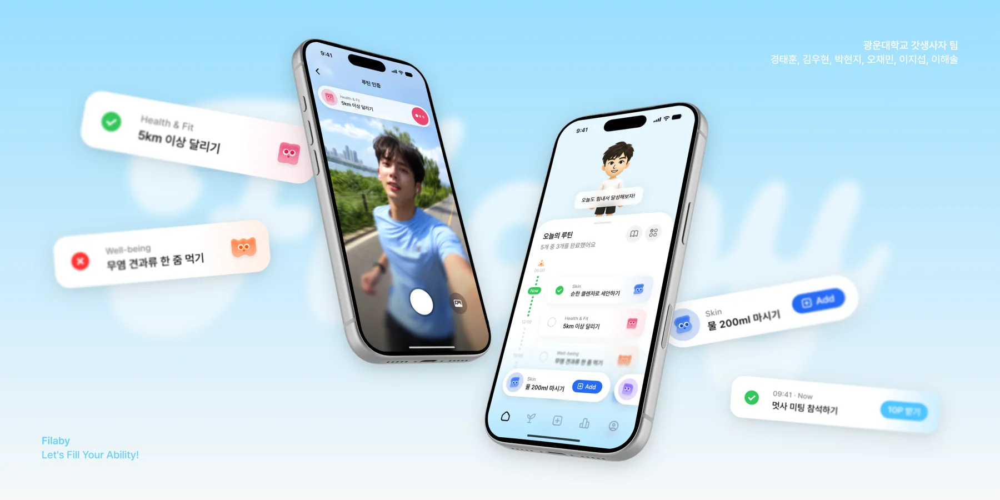
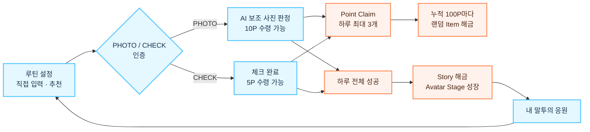
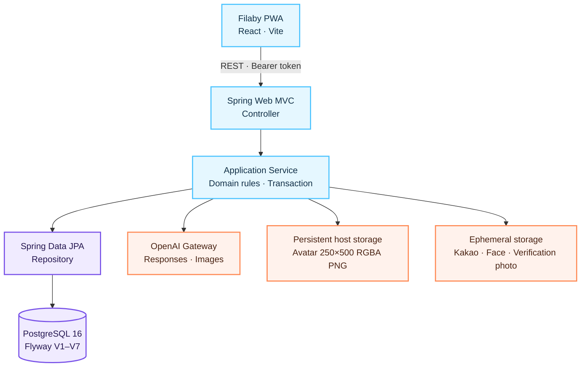

<div align="center">
  <a href="https://filaby.vercel.app/">
    
  </a>

  <br />
  <br />

  <h1>Filaby Backend</h1>

  <p><strong>Let's Fill Your Ability!</strong></p>
  <p>
    또 다른 나와 함께 채워가는 매일의 가능성.<br />
    루틴을 통해 AI 아바타와 함께 성장하는 모바일 웰니스 서비스입니다.
  </p>

  <p>
    <a href="https://filaby.vercel.app/"><strong>서비스 체험</strong></a>
    ·
    <a href="https://api.godlife.likelion.uk/api/v1/health"><strong>API 상태</strong></a>
    ·
    <a href="https://github.com/likelion-kwu/14th-hackathon-team2-frontend"><strong>Frontend</strong></a>
    ·
    <a href="./docs/갓생사자_API_SPEC_v4.4.md"><strong>API 명세</strong></a>
  </p>

  <p>
    <a href="https://github.com/likelion-kwu/14th-hackathon-team2-backend/actions/workflows/deploy-gabia.yml">
      
    </a>
    
    
    
    
  </p>
</div>

> **Naming note** — 최종 사용자 노출명은 **Filaby**입니다. 패키지명, DB·배포 자원, 일부 기획 문서에는 프로젝트 코드명 **갓생사자(Godsaeng Lion)** 가 남아 있습니다.

## Why Filaby?

피부·생활 루틴은 결과가 바로 보이지 않아 쉽게 멈추고, 단순 체크리스트는 금세 지루해집니다. Filaby는 오늘의 작은 행동을 **사진 인증**, **내 말투로 응원하는 미래 아바타**, **포인트·아이템·스토리 성장**으로 연결해 계속할 이유를 눈앞에 보여줍니다.

이 저장소는 그 경험을 지탱하는 REST API, 도메인 규칙, AI 파이프라인, 영속화와 배포 구성을 담당합니다.

## Core loop



`TO_DO`는 특정 날짜의 1회성 보조 작업입니다. 인증과 완료 기록은 남지만 오늘의 진행률, 하루 성공, Point, Item, Story, Competition 계산에서는 제외됩니다.

## What the backend owns

| 영역 | 제공하는 경험 | 백엔드가 보장하는 것 |
|---|---|---|
| Guest onboarding | 가입 없이 바로 시작 | Bearer guest token, 서버 기준 사용자 식별, 온보딩 단계 |
| AI Avatar | 나를 닮은 또 다른 나 | 선택적 얼굴 참조, 성장 트랙별 3단계 PNG, 생성 실패 fallback, 영속 파일 저장 |
| Speech style | 내 말투로 건네는 응원 | 프리셋 또는 Kakao ZIP 분석, 구조화 말투 프로필, 8개 상황 × 5개 대사 |
| Routine engine | 오늘 해야 할 일을 시간순으로 | 4개 성장 카테고리와 `TO_DO`, 반복 일정, 추천 catalog, 날짜별 snapshot |
| Verification | 실제 행동 순간을 기록 | 서버 시간창 검증, PHOTO 객체·손동작 AI 보조 판정 또는 CHECK, 중복 완료 방지 |
| Reward & growth | 행동이 수집과 서사로 이어짐 | Point 직접 수령, 100P Item milestone, 연속 성공 Story, 파생 Avatar Stage |
| Reflection | 쌓인 변화를 돌아봄 | 최대 31일 기록, 월간 캘린더 상태, 성공·부분·실패 집계 |
| Competition | 함께 이어가는 동기 | 월간 획득 Point 기준 공동 순위와 내 순위 |

## Architecture



### Design highlights

- **History first** — `DailyRoutine` snapshot으로 당시의 일정·카테고리·인증 대상을 보존합니다.
- **Explicit sources of truth** — 완료는 `RoutineVerification`, 하루 성공은 `DailySuccessRecord`, 지급 Point는 `RoutinePointClaim`, Story는 `UserStoryUnlock`에서 파생합니다.
- **Concurrency safe** — 사용자 단위 직렬화, row lock, DB `UNIQUE` 제약으로 중복 인증·수령·해금을 방어합니다.
- **AI outside transactions** — 외부 AI 호출과 DB 갱신을 분리하고 timeout·invalid response·fallback 경로를 명시적으로 처리합니다.
- **Privacy by cleanup** — Kakao 원문, 얼굴 원본, 인증 사진은 처리 중에만 사용하고 성공·실패와 관계없이 제거합니다.
- **No medical inference** — 아바타 변화는 Story 기반 게임 요소이며 피부·건강 진단이나 실제 미래 외모 예측을 하지 않습니다.

## Tech stack

| Layer | Technology |
|---|---|
| Language / Build | Java 17 · Gradle Wrapper 9.5.1 |
| Application | Spring Boot 4.1.0 · Spring Web MVC · Jakarta Validation |
| Data | Spring Data JPA · PostgreSQL 16 · Flyway |
| AI | OpenAI Responses API · Image API · Spring `RestClient` |
| Test | JUnit 5 · Spring Test · Testcontainers |
| Runtime | Docker multi-stage build · Docker Compose · Eclipse Temurin |
| Delivery | GitHub Actions · Gabia VM · health-check rollback |

## Quick start

가장 재현성 높은 실행 경로는 Docker Compose입니다.

### Prerequisites

- Docker Engine
- Docker Compose v2

### 1. Configure

```bash
git clone https://github.com/likelion-kwu/14th-hackathon-team2-backend.git
cd 14th-hackathon-team2-backend

cp .env.example .env
mkdir -p data/avatars
```

`.env`의 `POSTGRES_PASSWORD`를 반드시 안전한 값으로 바꾸세요. 생성형 Avatar, Kakao 말투 분석, PHOTO AI 보조 판정을 사용하려면 `OPENAI_API_KEY`도 설정해야 합니다. 키가 비어 있어도 프리셋과 기본 Avatar 등 정의된 비-AI·fallback 경로는 사용할 수 있습니다.

### 2. Run

```bash
docker compose config
docker compose up --build -d
```

### 3. Verify

```bash
curl --fail http://127.0.0.1:8080/api/v1/health
```

```json
{"data":{"status":"UP"}}
```

> Health API는 애플리케이션 프로세스의 liveness를 확인합니다. PostgreSQL·OpenAI readiness까지 검사하지는 않습니다.

### 4. Stop

```bash
docker compose logs -f backend
docker compose down
```

`docker compose down`은 PostgreSQL named volume과 Avatar 파일을 보존합니다. `docker compose down --volumes`는 DB 데이터를 삭제하므로 초기화 의도가 있을 때만 사용하세요.

> **Fresh DB note** — Flyway는 Story와 PHOTO mission seed를 넣지만 현재 Item catalog seed는 포함하지 않습니다. 새 DB에서 Item 해금 시나리오를 시연하려면 active Item 데이터를 별도로 준비해야 합니다.

## First API call

게스트 세션을 만들면 raw access token을 한 번 반환하고, 서버에는 SHA-256 hash만 저장합니다.

```bash
curl --request POST \
  http://127.0.0.1:8080/api/v1/sessions
```

응답의 `data.accessToken`을 이후 요청의 Bearer token으로 사용합니다.

```bash
curl --request PATCH \
  --header 'Authorization: Bearer <accessToken>' \
  --header 'Content-Type: application/json' \
  --data '{"nickname":"필라비"}' \
  http://127.0.0.1:8080/api/v1/users/me
```

성공 응답은 `{ "data": ..., "meta": ... }`, 오류 응답은 `code`, `message`, `details`, `traceId` 구조를 사용합니다.

## API map

모든 API의 base path는 `/api/v1`이며, 세션 생성과 health check를 제외한 사용자 API에는 Bearer token이 필요합니다.

| Domain | Endpoint group |
|---|---|
| Health / Session / User | `/health` · `/sessions` · `/users/me` |
| Avatar / Dialogue | `/avatars/me` · `/avatar-dialogues/selections` |
| Speech style | `/speech-style` · `/speech-style/kakao/jobs` |
| Routine catalog | `/verification-objects` · `/routine-recommendations` |
| Routine | `/routines` · `/daily-routines` |
| Verification / Point | `/daily-routines/{id}/photo-mission` · `/verifications/*` · `/point-claim` |
| Home / Item / Story | `/home` · `/items` · `/stories` |
| Record / Competition | `/records` · `/competition/leaderboard` |

요청·응답 필드, 상태 코드와 오류 계약은 [API Specification v4.4](./docs/갓생사자_API_SPEC_v4.4.md)를 기준으로 합니다. 별도의 Swagger UI는 제공하지 않습니다.

## Project structure

```text
src/main/java/com/likelion/hackathon_be
├── common              # response, error, auth, CORS, time
├── session · user      # guest identity and onboarding
├── avatar · speech     # AI avatar and personalized voice
├── routine             # schedule, daily snapshot, verification, point
├── item · story        # collection and progression
├── home · record       # composed home view and reflection
├── competition         # monthly leaderboard
└── ai                  # shared OpenAI gateway and image validation

src/main/resources
├── db/migration        # Flyway V1–V7
├── catalog             # reviewed routine recommendations
├── speech              # safe dialogue fallback
└── avatar              # canonical avatar template
```

각 도메인은 필요에 따라 `api / application / domain / repository / infrastructure / dto`로 나뉩니다. Controller는 HTTP 계약을, Application Service는 정책과 transaction boundary를, Repository는 영속화를 담당합니다.

## Test & build

```bash
./gradlew test
./gradlew build
```

CI와 동일하게 처음부터 검증하려면 다음을 실행합니다.

```bash
./gradlew clean build --no-daemon
```

PostgreSQL 통합 테스트는 Testcontainers를 사용합니다. Docker가 없으면 해당 테스트만 자동으로 건너뛰며, 실제 OpenAI 호출 smoke test는 기본 비활성화되어 있습니다.

## Configuration

### Docker Compose

| Variable | Default / Requirement | Purpose |
|---|---|---|
| `POSTGRES_PASSWORD` | **required to change** | PostgreSQL password |
| `POSTGRES_DB` | `godsaeng_lion` | Database name |
| `POSTGRES_USER` | `godsaeng` | Database user |
| `APP_BIND_ADDRESS` | `127.0.0.1` | Published backend address |
| `APP_PORT` | `8080` | Published backend port |
| `AVATAR_HOST_PATH` | `./data/avatars` | Persistent Avatar directory |
| `OPENAI_API_KEY` | optional | Enables generation and analysis paths |
| `OPENAI_BASE_URL` | `https://api.openai.com` | OpenAI API base URL |
| `OPENAI_RESPONSES_MODEL` | `gpt-5.6-luna` | Text analysis / dialogue model |
| `OPENAI_IMAGE_MODEL` | `gpt-image-2` | Avatar image model |

전체 예시는 [.env.example](./.env.example), 컨테이너 운영 설명은 [Docker guide](./docs/docker.md)를 참고하세요. `.env`와 runtime upload·Avatar 디렉터리는 Git에서 제외됩니다.

<details>
<summary><strong>Run directly on the JVM</strong></summary>

외부 PostgreSQL을 준비하고 애플리케이션용 DB 변수를 직접 제공해야 합니다. Compose의 PostgreSQL은 host port를 publish하지 않으므로 현재 구성 그대로 DB만 Compose로 띄워 `bootRun`과 연결할 수는 없습니다.

```bash
DB_URL='jdbc:postgresql://127.0.0.1:5432/godsaeng_lion' \
DB_USERNAME='godsaeng' \
DB_PASSWORD='<password>' \
./gradlew bootRun
```

선택 변수는 `OPENAI_API_KEY`, `OPENAI_BASE_URL`, `OPENAI_RESPONSES_MODEL`, `OPENAI_IMAGE_MODEL`, `AVATAR_STORAGE_ROOT`, `SPEECH_WORK_ROOT`입니다.

</details>

## Delivery

```text
Pull Request
  → Gradle clean build
  → Docker image build

main push / manual dispatch
  → immutable image archive + SHA-256
  → SSH transfer to Gabia VM
  → Docker Compose release switch
  → /api/v1/health check
  → failure: previous container image rollback
```

운영 컨테이너는 non-root UID `10001`, read-only root filesystem, capability drop, `no-new-privileges`, 512MB tmpfs를 사용합니다. PostgreSQL은 named volume에, Avatar PNG는 `AVATAR_HOST_PATH`에 영속화됩니다.

현재 배포 흐름의 source of truth는 [GitHub Actions workflow](./.github/workflows/deploy-gabia.yml), [deployment script](./scripts/deploy-gabia.sh), [Compose configuration](./compose.yaml)입니다.

## Documents

| Document | Source of truth for |
|---|---|
| [Product Requirements v2.2](./docs/갓생사자_PRD_v2.2.md) | 제품 행동과 MVP 범위 |
| [API Specification v4.4](./docs/갓생사자_API_SPEC_v4.4.md) | HTTP 계약과 오류 동작 |
| [Database Design v1.9](./docs/갓생사자_backend_database_design_v1.9.md) | schema, constraint, transaction, lock |
| [Speech Style SRS v2.7](./docs/speech_style_system_SRS_v2.7.md) | Kakao 입력과 말투 분석 규칙 |
| [Project Common Prompt v4.1](./docs/project_common_prompt_v4.1.md) | 공통 제품 정책과 구현 guardrail |
| [Docker Guide](./docs/docker.md) | 로컬 Compose와 데이터 영속화 |

---

<div align="center">
  <strong>Filaby</strong> · 2026 멋쟁이사자처럼 중앙해커톤<br />
  광운대학교 갓생사자 팀
</div>
