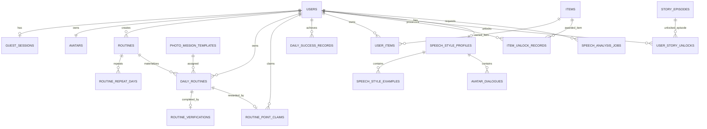

# 갓생사자 Backend Database Design v1.9

- 작성 기준일: 2026-08-19
- 대상 프로젝트: 2026 멋쟁이사자처럼 중앙해커톤 AAC 기업 연계 MVP
- 문서 목적: Codex CLI와 백엔드 팀원이 DB / ORM / Migration 구현 시 따르는 데이터 설계 기준
- 상위 제품 기준 문서: `갓생사자_PRD_v2.2.md`
- 공통 구현 기준 문서: `project_common_prompt_v4.1.md`
- 말투 기능 기준 문서: `speech_style_system_SRS_v2.7.md`
- 이전 버전: `갓생사자_backend_database_design_v1.8.md`
- 상태: **MVP DB 설계 Freeze 후보 — 현재 저장소 분석 후 DB별 DDL 문법만 조정**
- 2026-08-19 정책 동기화: `TO_DO`는 DailyRoutine/Verification은 생성할 수 있지만 진행률, DailySuccess, Story streak, RoutinePointClaim, Item/Competition Point 계산에서 제외한다. 별도 counter/status를 추가하지 않고 `category_snapshot`으로 제외한다. 월간 기록 캘린더도 같은 Source of Truth에서 파생하며 새 Calendar 테이블/상태 컬럼을 만들지 않는다.
- 핵심 목표: 2026-08-21까지 핵심 사용자 흐름을 안정적으로 시연할 수 있는 최소·일관 데이터 구조

> 이 문서는 특정 DB, ORM, Migration 도구를 임의로 강제하지 않는다.
> Codex CLI는 구현 전 현재 저장소의 DB, JPA, Migration, Entity 패턴을 먼저 분석해야 한다.
> 저장소와 본 문서가 충돌하면 코드를 먼저 변경하지 말고 차이를 보고한다.

---

# 1. v1.9 검토 결론

v1.1의 큰 방향은 유지하지만 다음 설계는 데이터 중복 또는 동시성 문제를 만들 수 있어 수정한다.

v1.9에서는 스키마를 추가하지 않고 월간 기록 캘린더를 Must 조회 기능으로 동기화한다. 캘린더는 기존 `DailyRoutine`, `RoutineVerification`, `DailySuccessRecord`에서 파생하고 `TO_DO`를 progression 집계에서 제외한다.

## 1.1 v1.9 확정 변경

2026-08-18 최종 합의로 Routine/Point 정책에 더해 Avatar asset 구조를 Freeze한다.

Avatar 확정:

```text
AvatarGrowthTrack = SKIN / WELL_BEING / HEALTH_FIT / DIET
TO_DO는 AvatarGrowthTrack에 포함하지 않음
사용자 얼굴 사진 = optional, 임시 사용 후 삭제
사진은 얼굴 reference만 사용, 실제 상태 분석 X
Stage 1 생성 → Stage 1 기준 Stage 2/3 각각 생성
최초 설정에서 Stage 1/2/3 모두 준비
최종 asset = 250×500 RGBA PNG
생성 asset = 가비아 host disk
DB = active asset_set_key만 저장
재생성 성공 1회 허용
Item asset = 프론트 250×500 정적 PNG overlay
```

Routine과 보상 정책:

```text
RoutineCategory = SKIN / WELL_BEING / HEALTH_FIT / DIET / TO_DO
RepeatType = DAILY / DAYS_OF_WEEK / ONCE
TO_DO = 특정 날짜 1회성 보조 작업
TO_DO = DailyRoutine/Verification 가능, 진행률/DailySuccess/Story/PointClaim/Item/Competition 제외
추천 Routine = DB 테이블 없이 서버 정적 Recommendation Pool
PHOTO Point = 10
CHECK Point = 5
Point 자동 지급 X, 완료 Routine을 눌러 당일 Claim
serviceDate당 Point Claim 최대 3개
누적 획득 Point 100P마다 랜덤 Item 해금, Point 차감 X
월간 경쟁 = 해당 달 Point Claim 합계, 동점 공동 순위
```

기존 누적 하루 성공일 기반 Item milestone은 제거한다. Point는 소비되지 않으므로 generic wallet/ledger/spend 구조를 만들지 않고 성공한 완료 루틴에 대한 `RoutinePointClaim`만 영속화한다.

프론트 연동 합의로 Story 실제 콘텐츠는 모든 사용자에게 동일한 **프론트 정적 asset**으로 관리한다.

따라서 백엔드는 Story에서 다음만 책임진다.

```text
episode_number
required_streak
avatar_stage
active
UserStoryUnlock
```

`title`, `content_asset_key`, 본문/장면 데이터는 DB에 중복 저장하지 않는다.

Avatar Stage 이미지 저장·전달 방식과 Item overlay 규칙은 v1.8에서 확정한다. 별도 `avatar_assets`/slot/layer 좌표 테이블을 만들지 않고 `avatars.asset_set_key`와 `UserItem.equipped`를 기준으로 한다.

## 1.2 제거 또는 변경

```text
DailyRoutine.status
→ 제거
→ 성공 RoutineVerification 존재 여부가 개별 루틴 완료의 유일한 기준

DailySuccessRecord.streak_count
→ 제거
→ 연속 성공은 DailyRoutine 예정일 + DailySuccessRecord에서 계산

기존 success-day Item milestone
→ 제거
→ Item은 누적 획득 Point의 100P 배수에서 해금
→ 처리 이력은 ItemUnlockRecord.required_points로 영속 기록

Avatar.appearance_json.equippedItemIds
→ 사용하지 않음
→ 장착 상태는 UserItem.equipped가 기준

SpeechStyleProfile scalar 값과 style_json의 동일 필드 중복
→ 영속 표현에서 분리
→ scalar 컬럼은 조절 가능한 핵심값의 기준
→ style_json은 패턴·문장부호·허용 욕설 등 가변 상세값만 저장
```

## 1.3 동시성 보강

다음 경우를 막아야 한다.

```text
같은 DailyRoutine에 PHOTO/CHECK 동시 요청
같은 serviceDate의 마지막 두 루틴 동시 완료
서로 다른 serviceDate의 하루 성공이 동시에 확정되어 item milestone 경쟁
종료 직전 접수된 PHOTO의 AI 판정이 자정 이후 완료되어 이전 serviceDate 성공이 늦게 확정됨
```

MVP에서는 **사용자 row 단위 lock + 해당 serviceDate의 DailyRoutine row lock + DB UNIQUE** 조합을 사용한다.

## 1.4 당일 루틴 집합 고정

하루 성공 판정의 분모가 중간에 변하지 않도록 최신 PRD의 규칙을 따른다.

```text
같은 serviceDate에서 성공 Verification 1건 이상
→ 해당 serviceDate의 DailyRoutine 집합 고정

이미 시작 시간이 지난 루틴
→ 수정/삭제로 당일 수행 대상을 소급 변경하지 않음
```

---

# 2. 핵심 데이터 흐름

```text
GuestSession
→ User

User
├─ Avatar
├─ SpeechStyle
└─ Routine
    └─ DailyRoutine
        └─ RoutineVerification (0..1)

같은 serviceDate의 `category_snapshot != TO_DO` DailyRoutine이 1개 이상 존재하고
그 대상 DailyRoutine 모두에 Verification 존재
→ DailySuccessRecord 1건

`category_snapshot != TO_DO` RoutineVerification 성공
→ 사용자가 같은 serviceDate 안에서 Point Claim
→ RoutinePointClaim (PHOTO 10 / CHECK 5, 일 최대 3개)
→ 누적 획득 Point 100P milestone
→ ItemUnlockRecord
→ UserItem

DailyRoutine 예정 serviceDate + DailySuccessRecord
→ 연속 성공 분석
→ StoryEpisode 해금
→ UserStoryUnlock

UserStoryUnlock의 최대 avatarStage
→ 현재 Avatar Stage
```

---

# 3. Source of Truth

같은 상태를 두 군데 저장하지 않는 것을 원칙으로 한다.

| 의미 | Source of Truth |
|---|---|
| 개별 루틴 완료 | `RoutineVerification` 존재 여부 |
| PHOTO / CHECK 방식 | `RoutineVerification.verification_type` |
| 오늘 진행률 | 해당 `serviceDate`의 `category_snapshot != TO_DO` DailyRoutine 수 대비 해당 Verification 수 |
| 월간 기록 캘린더 | 표시 월의 `DailyRoutine` + `RoutineVerification` + `DailySuccessRecord`에서 파생 (`TO_DO` 제외) |
| 월 달성일 수 | 표시 월의 `DailySuccessRecord` 수 |
| 하루 전체 성공 | `category_snapshot != TO_DO` 대상만으로 생성한 `DailySuccessRecord` |
| 누적 하루 성공일 | `COUNT(DailySuccessRecord)` |
| Point 수령 | `RoutinePointClaim` 존재 여부 |
| 누적 획득 Point | `SUM(RoutinePointClaim.amount)` |
| 월간 경쟁 Point | 해당 월 `RoutinePointClaim.amount` 합계 |
| 연속 성공 | `category_snapshot != TO_DO`인 `DailyRoutine.service_date` + `DailySuccessRecord.service_date` 계산 |
| Item 보유 | `UserItem` |
| Item milestone 처리 | `ItemUnlockRecord.required_points` |
| Story 해금 | `UserStoryUnlock` |
| Avatar 성장 트랙 | `Avatar.growth_track` |
| Avatar 활성 이미지 세트 | `Avatar.asset_set_key` |
| Avatar Stage | 해금 Story의 `MAX(StoryEpisode.avatar_stage)`, 없으면 1 |
| Item 장착 | `UserItem.equipped` |
| 활성 말투 | `SpeechStyleProfile` 사용자당 최대 1개 |

저장하지 않는다.

```text
experience
xp
coin
point_balance
monthly_point_counter
total_point_counter
growth_stage
daily_routine_status
current_streak
total_success_days
```

---

# 4. 전체 ERD



---

# 5. MVP 테이블 목록

```text
1. users
2. guest_sessions
3. avatars

4. routines
5. routine_repeat_days
6. daily_routines
7. photo_mission_templates
8. routine_verifications
9. routine_point_claims
10. daily_success_records

11. items
12. user_items
13. item_unlock_records

14. story_episodes
15. user_story_unlocks

16. speech_style_profiles
17. speech_style_examples
18. avatar_dialogues
19. speech_analysis_jobs
```

총 **19개**를 기본안으로 한다.

명시적으로 만들지 않는다.

```text
generic_point_transactions
point_wallets
monthly_leaderboards
item_unlock_milestones
verification_photos
avatar_growth
avatar_appearance
routine_records
routine_statistics
weekly_statistics
monthly_statistics
demo_users
demo_sessions
```

---

# 6. 공통 정책

## 6.1 ID

권장 논리 설계:

```text
일반 영속 Entity → BIGINT identity / auto increment
임시 분석 Job → UUID
```

기존 저장소가 다른 PK 전략을 이미 사용한다면 그 패턴을 우선한다.

## 6.2 시간

서비스 기준 시간대:

```text
Asia/Seoul
```

구분:

```text
created_at / updated_at / verified_at / unlocked_at
→ 절대 시각

service_date
→ 루틴 수행의 논리 날짜

start_time / end_time
→ 루틴의 로컬 시간
```

Java 권장:

```text
Instant 또는 OffsetDateTime
LocalDate
LocalTime
```

DB 타입은 실제 DB에 맞춘다.

## 6.3 Enum

JPA를 사용하면 ordinal 저장을 금지한다.

```java
@Enumerated(EnumType.STRING)
```

## 6.4 Immutable History

다음 데이터는 정상 사용자 기능으로 수정·삭제하지 않는다.

```text
RoutineVerification
DailySuccessRecord
ItemUnlockRecord
UserStoryUnlock
```

Routine 수정·삭제는 과거 스냅샷과 성공·해금 기록을 소급 변경하지 않는다.

---

# 7. USERS

## 목적

일반 게스트 사용자 데이터의 기준점.

| 컬럼 | 논리 타입 | NULL | 제약 |
|---|---|---:|---|
| id | BIGINT | N | PK |
| nickname | VARCHAR(30) | Y | 최초 설정 후 필수 |
| created_at | TIMESTAMP | N |  |
| updated_at | TIMESTAMP | N |  |

## nickname 정책

제품에서는 필수다.

단, 구현 흐름이:

```text
게스트 세션 생성
→ User 생성
→ nickname 입력
```

이면 생성 순간에는 NULL일 수 있다.

Home 진입은 다음을 모두 만족해야 한다.

```text
nickname 존재
Avatar 설정 완료
SpeechStyleProfile 존재
```

현재 저장소가 User 생성 요청에서 nickname을 함께 필수로 받는다면 `NOT NULL`을 유지해도 된다.

## Demo

다음 필드를 두지 않는다.

```text
user_type
demo_mode
demo_user
```

발표용 사용자도 일반 Guest와 같은 구조를 사용한다.

---

# 8. GUEST_SESSIONS

| 컬럼 | 논리 타입 | NULL | 제약 |
|---|---|---:|---|
| id | UUID | N | PK |
| user_id | BIGINT | N | FK, UNIQUE |
| token_hash | VARCHAR(255) | N | UNIQUE |
| expires_at | TIMESTAMP | Y |  |
| created_at | TIMESTAMP | N |  |

정책:

```text
브라우저 → opaque token
DB → token hash
```

- 클라이언트의 임의 `userId`를 인증 근거로 사용하지 않는다.
- 가능하면 HttpOnly Cookie를 사용한다.
- 사용자당 활성 GuestSession 1개를 MVP 기본안으로 한다.
- 토큰 회전 시 같은 row를 갱신할 수 있다.

FK:

```text
guest_sessions.user_id
→ users.id
ON DELETE CASCADE
```

---

# 9. AVATARS

## 목적

사용자의 고정 성장 트랙과 현재 활성 Stage 이미지 세트를 저장한다.

| 컬럼 | 논리 타입 | NULL | 제약 |
|---|---|---:|---|
| id | BIGINT | N | PK |
| user_id | BIGINT | N | FK, UNIQUE |
| growth_track | VARCHAR(20) | N | ENUM |
| asset_set_key | VARCHAR(255) | N | 현재 활성 Stage 세트의 논리 key |
| asset_source | VARCHAR(20) | N | ENUM |
| regeneration_count | SMALLINT | N | DEFAULT 0, MVP 0~1 |
| created_at | TIMESTAMP | N |  |
| updated_at | TIMESTAMP | N |  |

### AvatarGrowthTrack

```text
SKIN
WELL_BEING
HEALTH_FIT
DIET
```

`TO_DO`는 Routine category일 뿐 Avatar 성장 트랙이 아니다.

MVP에서는 Avatar가 생성된 뒤 `growth_track`을 변경하지 않는다.

### AvatarAssetSource

```text
GENERATED
DEFAULT
```

- `GENERATED`: AI 생성/편집을 통해 준비된 사용자용 Stage 세트
- `DEFAULT`: 초기 AI 생성이 자동 재시도 후에도 실패했을 때 사용하는 트랙별 기본 Stage 세트

## asset_set_key

DB에는 이미지 binary 또는 서버의 절대 파일 경로를 저장하지 않는다.

예:

```text
avatars/1001/01K...A7
```

실제 host disk:

```text
${AVATAR_STORAGE_ROOT}/avatars/1001/01K...A7/stage1.png
${AVATAR_STORAGE_ROOT}/avatars/1001/01K...A7/stage2.png
${AVATAR_STORAGE_ROOT}/avatars/1001/01K...A7/stage3.png
```

기본 fallback 세트는 구현에 따라 다음과 같은 고정 key를 사용할 수 있다.

```text
defaults/SKIN
defaults/WELL_BEING
defaults/HEALTH_FIT
defaults/DIET
```

Stage 파일명 규칙은 고정한다.

```text
stage1.png
stage2.png
stage3.png
```

최종 asset 규격:

```text
250×500
PNG
RGBA transparent
동일 canvas / pose / body position
```

## Avatar Stage

현재 Stage 자체는 Avatar row에 저장하지 않는다.

```text
해금 Story 없음 → Stage 1
해금 Story 중 MAX(avatar_stage) → 현재 Stage
```

Story 해금은 영구 기록이므로 streak가 끊겨도 Stage는 퇴화하지 않는다.

백엔드는 현재 Stage와 `asset_set_key`를 조합해 제공할 파일을 결정한다. Stage 2/3 asset이 서버에 미리 존재해도 해금 전에는 API에서 노출하지 않는다.

## regeneration_count

온보딩에서 **성공한 세트 재생성 1회**를 허용한다.

```text
0 → 아직 성공한 재생성 없음
1 → 재생성 완료, 추가 재생성 금지
```

새 세트 생성이 실패하여 기존 세트를 유지한 경우에는 기존 활성 세트를 덮어쓰지 않는다.

## 저장하지 않는다

```text
experience
xp
coin
point_balance
monthly_point_counter
total_point_counter
growth_stage
equippedItemIds
appearance_json
사용자 원본 얼굴 사진
```

장착 Item의 유일한 기준은 `UserItem.equipped`다.

---

# 9A. AVATAR FILE STORAGE / GENERATION LIFECYCLE

Avatar 이미지는 DB binary가 아니라 가비아 서버 host disk에 저장한다.

권장 host directory:

```text
/var/lib/godsaengsaja/avatars
```

Docker 예:

```text
host:      /var/lib/godsaengsaja/avatars
container: /app/data/avatars
```

애플리케이션은 절대 경로가 아니라 환경 변수 `AVATAR_STORAGE_ROOT`와 `asset_set_key`를 조합한다.

### 최초 생성

```text
optional face photo 임시 확보
→ 입력 검증
→ Stage 1 생성
→ Stage 1을 reference로 Stage 2/3 각각 생성
→ 실패한 생성은 자동 1회 재시도
→ 세 장 최종 250×500 RGBA PNG 정규화
→ 임시 asset set directory에 저장
→ 세 장 모두 준비되면 Avatar row INSERT/UPDATE
→ 원본 face photo finally 삭제
```

초기 생성이 재시도 후에도 실패하면 트랙별 `DEFAULT` 세트를 연결해 온보딩을 계속한다.

### 재생성

```text
기존 asset_set_key 유지
→ 새 임시 asset set 생성
→ Stage 1/2/3 모두 성공
→ 짧은 DB Transaction에서 asset_set_key 교체 + regeneration_count=1
→ commit 후 기존 사용자 생성 세트 삭제
```

새 세트 생성 실패 시 기존 세트를 유지한다. 외부 AI 호출을 DB Transaction 안에서 수행하지 않는다.

사용자 얼굴 사진은 영속 DB/파일 저장소에 보관하지 않는다. 재생성 시 동일 사진이 필요하면 프론트가 다시 전송한다.

---

# 10. ROUTINES

## 목적

반복 또는 1회성 루틴 설정 원본.

| 컬럼 | 논리 타입 | NULL | 제약 |
|---|---|---:|---|
| id | BIGINT | N | PK |
| user_id | BIGINT | N | FK |
| category | VARCHAR(20) | N | ENUM |
| content | VARCHAR(100) | N |  |
| start_time | TIME | N |  |
| end_time | TIME | N |  |
| repeat_type | VARCHAR(20) | N | ENUM |
| verification_object | VARCHAR(40) | N | 지원 목록 |
| effective_from | DATE | N | 반복 최초 적용일 또는 ONCE 수행일 |
| deleted_at | TIMESTAMP | Y | soft delete |
| created_at | TIMESTAMP | N |  |
| updated_at | TIMESTAMP | N |  |

### RoutineCategory

```text
SKIN
WELL_BEING
HEALTH_FIT
DIET
TO_DO
```

### RepeatType

```text
DAILY
DAYS_OF_WEEK
ONCE
```

Validation:

```text
category in SKIN/WELL_BEING/HEALTH_FIT/DIET
→ repeat_type in DAILY/DAYS_OF_WEEK

category = TO_DO
→ repeat_type = ONCE
→ effective_from = 사용자가 지정한 수행 날짜

repeat_type = DAILY
→ repeat_days 없음

repeat_type = DAYS_OF_WEEK
→ repeat_days 최소 1개

repeat_type = ONCE
→ repeat_days 없음
→ DailyRoutine 정확히 1개 생성
```

공통 정책:

- 자유 텍스트 인증 물건 금지
- `start_time < end_time`, 자정 넘김 및 `24:00` 금지
- Routine 일반 삭제는 soft delete
- 과거 DailyRoutine/Verification/PointClaim은 유지
- Recommendation Pool은 정적 설정이므로 별도 DB 테이블을 만들지 않는다.

### TO_DO progression exclusion

`TO_DO`는 DailyRoutine과 RoutineVerification을 정상 생성한다. 다만 다음 계산에서는 항상 제외한다.

```text
오늘 진행률 분자/분모
DailySuccessRecord 생성 조건
ScheduledDates / streak 계산
RoutinePointClaim
ItemUnlockRecord 도달 Point
월간 Competition Point
```

DB에 별도 `progress_eligible`, `reward_eligible`, status, counter 컬럼을 추가하지 않는다. `DailyRoutine.category_snapshot == TO_DO`를 Service/Query 조건에서 제외하는 것이 Source of Truth다.

# 11. ROUTINE_REPEAT_DAYS

| 컬럼 | 논리 타입 | NULL | 제약 |
|---|---|---:|---|
| routine_id | BIGINT | N | PK, FK |
| day_of_week | VARCHAR(3) | N | PK, ENUM |

### DayOfWeek

```text
MON TUE WED THU FRI SAT SUN
```

PK:

```text
PRIMARY KEY(routine_id, day_of_week)
```

정책:

```text
DAILY
→ repeat day row 없음

DAYS_OF_WEEK
→ 최소 한 row 필요

ONCE
→ repeat day row 없음
```

`DAYS_OF_WEEK`인데 row가 0개인 상태는 Service validation으로 거부한다.

---

# 12. DAILY_ROUTINES

## 목적

특정 `serviceDate`에 실제로 존재했던 수행 대상의 스냅샷.

이 테이블이 필요한 이유:

- 오늘 진행률의 분모 (`category_snapshot != TO_DO`만 계산 대상)
- 과거 루틴 기록 (`TO_DO` 포함)
- 루틴이 있던 실패일과 원래 루틴이 없던 날 구분
- 반복 설정 수정 후 과거 상태 보존
- 연속 하루 성공 계산

| 컬럼 | 논리 타입 | NULL | 제약 |
|---|---|---:|---|
| id | BIGINT | N | PK |
| routine_id | BIGINT | N | FK |
| user_id | BIGINT | N | FK |
| service_date | DATE | N | UNIQUE 구성 |
| category_snapshot | VARCHAR(20) | N | ENUM |
| content_snapshot | VARCHAR(100) | N |  |
| start_time_snapshot | TIME | N |  |
| end_time_snapshot | TIME | N |  |
| verification_object_snapshot | VARCHAR(40) | N |  |
| mission_template_id | BIGINT | Y | FK |
| created_at | TIMESTAMP | N |  |
| updated_at | TIMESTAMP | N |  |

## 완료·시간 상태를 저장하지 않는다

`status` 컬럼을 두지 않는다.

영속 데이터와 현재 서버 시각에서 상태를 파생한다.

```text
Verification 존재
→ COMPLETED

Verification 없음
AND now < actualStartAt
→ UPCOMING

Verification 없음
AND actualStartAt <= now < actualEndAtExclusive
→ AVAILABLE / PENDING

Verification 없음
AND now >= actualEndAtExclusive
→ FAILED
```

`FAILED`도 별도 DB 상태로 저장하지 않는다. 종료 시각과 Verification 부재로 항상 재현 가능하다.

이것이 유일한 완료/실패 판정 기준이다.

따라서 다음 모순 상태 자체를 만들지 않는다.

```text
COMPLETED인데 Verification 없음
PENDING인데 Verification 있음
```

## 핵심 UNIQUE

```text
UNIQUE(routine_id, service_date)
```

## user_id 중복 저장

`routine_id`로 User를 알 수 있지만 다음 조회가 매우 빈번하다.

```text
user + serviceDate의 DailyRoutine 전체 조회
```

MVP에서는 쿼리와 권한 검증 단순화를 위해 `user_id`를 직접 저장한다.

Service는 생성 시 반드시:

```text
DailyRoutine.userId == Routine.userId
```

를 보장한다.

기존 DB가 composite FK를 자연스럽게 지원하고 팀이 익숙하지 않다면 이를 위해 불필요한 composite FK를 추가하지 않는다.

---

# 13. DailyRoutine 집합 고정 규칙

## 13.1 serviceDate Lock 판정

다음 조건이면 해당 사용자의 해당 `serviceDate` 수행 대상 집합은 고정된다.

```text
그 serviceDate의 DailyRoutine 중
RoutineVerification이 1건 이상 존재
```

사진 인증 실패는 Verification을 만들지 않으므로 집합 고정 조건이 아니다.

## 13.2 첫 인증 이전

첫 성공 Verification 이전에는 아직 시작하지 않은 시간대의 변경이 오늘에 반영될 수 있다.

## 13.3 시작 시간이 지난 Routine

대상 DailyRoutine의 수행 시작 시간이 이미 지났다면 수정·삭제로 당일 수행 대상을 소급 변경하지 않는다.

변경은 다음 적용 가능한 반복일부터 반영한다.

## 13.4 첫 성공 인증 이후

해당 serviceDate에서 첫 성공 Verification이 생긴 뒤:

```text
Routine 생성
Routine 수정
Routine 삭제
```

가 그 serviceDate의 DailyRoutine 목록을 변경하면 안 된다.

모두 다음 적용 가능한 반복일부터 반영한다.

## 13.5 이미 성공한 날

`DailySuccessRecord`가 이미 존재하는 날은 절대 재계산해 취소하지 않는다.

이후 Routine 변경은 과거:

```text
RoutineVerification
DailySuccessRecord
ItemUnlockRecord
UserStoryUnlock
```

을 삭제하거나 취소하지 않는다.

---

# 14. DailyRoutine Materialization

## 14.1 이유

단순히 사용자가 앱을 연 날만 DailyRoutine을 생성하면:

```text
루틴이 있었지만 앱 미접속
vs
원래 루틴 없음
```

을 구분할 수 없다.

따라서 예정 수행일을 영속화한다.

## 14.2 기본 horizon

MVP 권장 기본값:

```text
60일
```

코드 상수 또는 설정으로 관리한다.

DB 구조에 숫자를 박지 않는다.

## 14.3 Routine 생성

```text
Routine 생성
→ effective_from 계산
→ 반복 규칙 확인
→ effective_from ~ current + horizon
→ applicable serviceDate의 DailyRoutine 생성

ONCE는 `effective_from` 날짜에 DailyRoutine 1개만 생성하고 horizon 확장을 하지 않는다.
```

## 14.4 Routine 변경 전 역사 보존

Routine을 수정하거나 삭제하기 전에 **기존 규칙으로 최소 현재 serviceDate까지 materialization을 보충**한다.

이렇게 해야 장기간 미접속 후 돌아온 사용자의 과거 실패 예정일이 새 설정으로 덮이지 않는다.

## 14.5 수정

변경 효력일 이후의 **미인증 DailyRoutine**만 다시 생성 대상이 될 수 있다.

다음은 유지한다.

```text
과거 serviceDate
Verification이 있는 DailyRoutine
집합 고정된 serviceDate의 DailyRoutine
```

당일 효력 여부는 13장의 집합 고정 규칙과 시작 시간 규칙을 따른다.

## 14.6 삭제

Routine은 soft delete한다.

효력일 이후의 미인증 미래 DailyRoutine만 제거한다.

과거 기록과 고정된 serviceDate의 DailyRoutine은 유지한다.

## 14.7 장기 미접속 후 복귀

단순히 `MAX(service_date)` 이후만 60일 추가하는 것으로 끝내지 않는다.

복귀 시:

```text
마지막 materialized serviceDate + 1
→ 현재 날짜
→ 현재 + horizon
```

사이에 비어 있는 적용 날짜를 **중간 gap까지 backfill**한다.

Routine 변경이 없던 미접속 기간이므로 현재 Routine 규칙으로 backfill할 수 있다.

## 14.8 구현 방식

다음 중 저장소에 맞는 단순한 방식을 사용한다.

- 사용자 주요 요청 시 `ensureMaterialized`
- 하루 1회 scheduler + 요청 시 보정

Kafka/Queue는 필요 없다.

---

# 15. PHOTO_MISSION_TEMPLATES

| 컬럼 | 논리 타입 | NULL | 제약 |
|---|---|---:|---|
| id | BIGINT | N | PK |
| gesture_code | VARCHAR(40) | N |  |
| instruction_template | VARCHAR(150) | N |  |
| active | BOOLEAN | N | DEFAULT TRUE |
| created_at | TIMESTAMP | N |  |

정책:

- 사전 정의 미션이 Must 기본안
- AI 미션 생성은 조건부
- DailyRoutine에 이미 할당된 Template은 hard delete하지 않는다.
- 미사용 처리 시 `active=false`

FK 권장:

```text
daily_routines.mission_template_id
→ photo_mission_templates.id
ON DELETE RESTRICT
```

역사 미션의 참조가 사라지지 않도록 한다.

---

# 16. ROUTINE_VERIFICATIONS

## 목적

성공한 개별 루틴 인증만 저장한다.

## 인증 시간창

성공 Verification 생성 전에 서버가 반드시 실제 수행 시간창을 검증한다.

DailyRoutine snapshot을 이용해 실제 시각을 계산한다.

MVP에서는 자정 넘김을 허용하지 않으므로 생성·수정 시 반드시:

```text
start_time < end_time
```

를 검증한다.

```text
actualStartAt
= serviceDate + start_time_snapshot

actualEndAtExclusive
= serviceDate + end_time_snapshot + 1분
```

API의 시간 입력 정밀도는 `HH:mm`이므로 종료 분 전체를 인증 가능 구간에 포함하기 위해 **exclusive end**를 사용한다.

예:

```text
07:00~09:00
→ 07:00:00 이상 09:01:00 미만 인증 가능

22:00~23:59
→ 22:00:00 이상 다음 날 00:00:00 미만 인증 가능
```

`23:00~01:00`, `20:00~08:00`, `09:00~09:00`은 Validation 오류다.

`24:00`은 API/DB 값으로 지원하지 않는다. Java `LocalTime`과 DB `TIME`에는 `00:00~23:59` 범위만 사용한다.

서버 판정:

```text
verificationRequestedAt < actualStartAt
→ ROUTINE_NOT_STARTED

actualStartAt <= verificationRequestedAt < actualEndAtExclusive
→ 인증 처리 가능

verificationRequestedAt >= actualEndAtExclusive
→ ROUTINE_WINDOW_CLOSED
→ 새 Verification 생성 금지
```

`verificationRequestedAt`은 **클라이언트 값이 아니라 서버가 인증 요청을 최초 수신할 때 캡처한 시각**이다.

PHOTO는 AI 호출 전에 시간창을 1차 검사한다.

```text
요청 시작 < actualEndAtExclusive
→ AI 판정 진행 가능
→ AI가 종료 후 끝나도 해당 요청은 계속 완료 가능

요청 시작 >= actualEndAtExclusive
→ AI 호출 자체를 하지 않음
```

CHECK도 서버 요청 수신 시각을 기준으로 동일하게 검사한다.

종료 후에는 PHOTO 재촬영 또는 CHECK 전환을 새로 시작할 수 없다.


| 컬럼 | 논리 타입 | NULL | 제약 |
|---|---|---:|---|
| id | BIGINT | N | PK |
| daily_routine_id | BIGINT | N | FK, UNIQUE |
| verification_type | VARCHAR(10) | N | ENUM |
| verified_at | TIMESTAMP | N |  |
| created_at | TIMESTAMP | N |  |

### VerificationType

```text
PHOTO
CHECK
```

### 핵심 제약

```text
UNIQUE(daily_routine_id)
```

따라서:

```text
PHOTO XOR CHECK
```

를 DB가 최종 보장한다.

## 사진 인증 실패

다음 경우 Verification을 만들지 않는다.

```text
물건 미탐지
gesture 미탐지
판정 불가
Vision API 오류
```

사용자는 재촬영 또는 CHECK로 전환할 수 있다.

## Point 정책과 분리

Verification 자체에는 Point 컬럼을 저장하지 않는다. `TO_DO`가 아닌 경우에만 VerificationType에 따라 Claim 시 서버가 정책 값을 결정한다. `TO_DO` Verification은 성공 기록만 남고 Claim으로 이어지지 않는다.

```text
PHOTO → 10P
CHECK → 5P
```

인증 성공과 Point 수령은 서로 다른 시점이므로 `RoutinePointClaim`을 별도로 저장한다.

---


# 16.1 ROUTINE_POINT_CLAIMS

## 목적

성공한 DailyRoutine에서 사용자가 **당일 직접 수령한 Point**를 기록한다. Point는 소비되지 않으므로 일반 거래 ledger가 아니라 Claim 기록만 둔다.

| 컬럼 | 논리 타입 | NULL | 제약 |
|---|---|---:|---|
| id | BIGINT | N | PK |
| user_id | BIGINT | N | FK |
| daily_routine_id | BIGINT | N | FK, UNIQUE |
| amount | SMALLINT | N | 5 또는 10 |
| claimed_at | TIMESTAMP | N |  |
| created_at | TIMESTAMP | N |  |

핵심:

```text
UNIQUE(daily_routine_id)
```

Claim 조건:

```text
RoutineVerification 존재
AND DailyRoutine.category_snapshot != TO_DO
AND authenticated user가 해당 DailyRoutine 소유
AND server current serviceDate == DailyRoutine.service_date
AND 해당 user + serviceDate의 기존 PointClaim 수 < 3
AND 해당 DailyRoutine PointClaim 없음
```

금액은 클라이언트가 보내지 않는다. 먼저 `category_snapshot != TO_DO`를 검증한 뒤 서버가 VerificationType으로 결정한다.

```text
PHOTO → 10
CHECK → 5
```

자정이 지나면 과거 serviceDate의 미수령 Point는 Claim할 수 없다.

별도 저장하지 않는다.

```text
point_balance
monthly_points
total_points
point_spend
```

필요 값은 Claim 합계로 계산한다.

```text
누적 획득 Point = SUM(amount)
월간 경쟁 Point = Asia/Seoul 기준 해당 월 claimed_at의 SUM(amount)
```

# 17. DAILY_SUCCESS_RECORDS

## 목적

하루 전체 루틴 성공을 `serviceDate`당 정확히 1건 기록한다.

| 컬럼 | 논리 타입 | NULL | 제약 |
|---|---|---:|---|
| id | BIGINT | N | PK |
| user_id | BIGINT | N | FK |
| service_date | DATE | N | UNIQUE 구성 |
| completed_at | TIMESTAMP | N | 마지막 루틴 성공 인증 시각 |
| created_at | TIMESTAMP | N |  |

핵심:

```text
UNIQUE(user_id, service_date)
```

## 생성 조건

해당 `user + serviceDate`에:

```text
eligibleDailyRoutine = DailyRoutine WHERE category_snapshot != TO_DO

eligibleDailyRoutine >= 1
AND
모든 eligibleDailyRoutine에 RoutineVerification 존재
```

할 때만 생성한다. `TO_DO`가 미완료/실패여도 DailySuccess에는 영향을 주지 않으며, `TO_DO`만 존재하는 serviceDate에는 DailySuccessRecord를 생성하지 않는다.

## 왜 streak_count를 저장하지 않는가

종료 이후 새 인증은 허용하지 않지만, **당일 마지막 루틴의 PHOTO 요청이 종료 직전에 접수되어 AI 판정이 자정 이후 끝나는 경우** 이전 `serviceDate`의 성공이 다음 날짜 처리보다 늦게 DB에 확정될 수 있다.

또한 streak는 `DailyRoutine` 예정일과 `DailySuccessRecord`로 재현할 수 있으므로 중복 counter를 저장하지 않는다.

따라서:

```text
current_streak
streak_count
longest_streak
```

을 DailySuccessRecord에 저장하지 않는다.

---

# 18. 누적 성공일 계산

Source of Truth:

```text
COUNT(daily_success_records WHERE user_id = ?)
```

별도 `User.total_success_days`를 두지 않는다.

누적 성공일은 기록/분석용이다. Item 해금에는 사용하지 않는다.

---

# 19. 연속 성공 계산

## 19.1 기본 데이터

연속 여부에 필요한 것은 두 집합이다.

```text
ScheduledDates
= 사용자에게 `category_snapshot != TO_DO` DailyRoutine이 1개 이상 존재하는 distinct serviceDate

SuccessDates
= DailySuccessRecord.serviceDate
```

루틴이 없는 날은 ScheduledDates에 없기 때문에 자동으로 건너뛴다.

## 19.2 역사상 달성한 최대 streak

Story 영구 해금에는 `maxAchievedStreak`를 사용한다.

계산:

```text
ScheduledDates를 오름차순 순회

if date ∈ SuccessDates
    current += 1
    max = max(max, current)
else
    current = 0
```

루틴 없는 날은 ScheduledDates 자체에 없으므로 streak를 끊지 않는다.

## 19.3 성공 확정 순서가 serviceDate 순서와 다를 수 있는 경우

종료 후 새 인증은 금지한다.

다만 다음 경우에는 과거 `serviceDate`의 성공 레코드가 다음 날짜 성공보다 DB에 늦게 반영될 수 있다.

```text
8/17의 23:59 종료 PHOTO 요청이 종료 전에 서버에 접수
→ AI 판정 진행
→ 00:00 이후 8/18 serviceDate가 시작
→ 이전 PHOTO 판정 성공 및 8/17 DailySuccessRecord가 늦게 반영될 수 있음
```

따라서 Story는 단순히:

```text
새 success의 streak == 10
```

만 검사하지 않는다.

새 DailySuccessRecord 생성 후 최신 데이터에서 `maxAchievedStreak`를 계산하고:

```text
required_streak <= maxAchievedStreak
AND 아직 미해금
```

인 Story를 모두 해금한다.

## 19.4 실패 확정과 현재 streak

미인증 DailyRoutine의 `actualEndAtExclusive`에 도달하면 그 Routine은 실패다.

다만 `TO_DO` 실패는 완료 기록상 실패일 뿐 DailySuccess/streak에는 영향을 주지 않는다.

해당 `serviceDate`의 `category_snapshot != TO_DO` Routine에 실패가 하나라도 생기는 순간:

```text
그 serviceDate는 하루 성공 불가
→ DailySuccessRecord 생성 불가
→ 현재 연속 성공은 중단
```

단, 종료 전에 서버가 수신한 유효한 PHOTO 요청이 아직 AI 판정 중인 경우에는 그 요청 결과가 확정될 때까지 해당 Routine을 최종 실패로 노출하는 시점을 요청 처리 흐름에서 조정할 수 있다.

DB에는 실패 상태나 `current_streak` counter를 저장하지 않는다. 현재 streak는 확정된 성공/실패 날짜를 기준으로 Service에서 계산한다.

---

# 20. ITEMS

| 컬럼 | 논리 타입 | NULL | 제약 |
|---|---|---:|---|
| id | BIGINT | N | PK |
| name | VARCHAR(50) | N |  |
| item_type | VARCHAR(30) | N | 세부 타입 TBD |
| asset_key | VARCHAR(255) | N | 실제 asset identifier |
| active | BOOLEAN | N | DEFAULT TRUE |
| created_at | TIMESTAMP | N |  |

없음:

```text
price
currency
purchase_count
```

아이템은 구매하지 않는다.

Item 삭제 대신 `active=false`를 우선한다.

---

# 21. USER_ITEMS

| 컬럼 | 논리 타입 | NULL | 제약 |
|---|---|---:|---|
| id | BIGINT | N | PK |
| user_id | BIGINT | N | FK |
| item_id | BIGINT | N | FK |
| equipped | BOOLEAN | N | DEFAULT FALSE |
| acquired_at | TIMESTAMP | N |  |

핵심:

```text
UNIQUE(user_id, item_id)
```

## 장착 Source of Truth

```text
UserItem.equipped
```

만 사용한다.

Avatar JSON에 장착 ID를 다시 넣지 않는다.

MVP Item 장착은 다음처럼 확정한다.

```text
여러 Item 동시 장착 허용
Item PNG = 프론트 250×500 transparent static asset
Avatar PNG 위에 frontend overlay
```

DB에는 slot, x/y 좌표, bodyPart, layerOrder를 저장하지 않는다. `items.asset_key`는 프론트 정적 asset 식별자이며 프론트가 고정 렌더 순서를 관리한다. Item pool 자체는 겹쳐도 시연 가능한 조합으로 준비한다.

---

# 22. ITEM_UNLOCK_RECORDS

## 목적

누적 획득 Point의 100P milestone을 이미 처리했는지 기록한다.

| 컬럼 | 논리 타입 | NULL | 제약 |
|---|---|---:|---|
| id | BIGINT | N | PK |
| user_id | BIGINT | N | FK |
| required_points | INT | N | 100의 양의 배수 |
| item_id | BIGINT | Y | FK |
| processed_at | TIMESTAMP | N |  |

핵심:

```text
UNIQUE(user_id, required_points)
CHECK(required_points > 0)
```

`required_points`는 `100, 200, 300, ...` 형태다. 고정 milestone 테이블을 두지 않고 총 획득 Point에서 도달한 100P 배수를 계산한다.

## item_id가 NULL인 경우

해당 milestone은 처리했지만 해금 가능한 미보유 active Item이 없음을 의미한다. 나중에 Item이 추가되어도 같은 과거 milestone을 재지급하지 않는다.

## 처리 로직

Point Claim INSERT 후 같은 Transaction에서:

```text
totalEarnedPoints = SUM(RoutinePointClaim.amount)
highestReached = floor(totalEarnedPoints / 100) * 100

100..highestReached 중
ItemUnlockRecord가 없는 required_points를 모두 처리

각 milestone:
미보유 active Item 후보 조회
→ 애플리케이션 random 1개 선택
→ ItemUnlockRecord INSERT
→ Item이 있으면 UserItem INSERT
```

Item 해금으로 Point를 차감하지 않는다.

# 23. STORY_EPISODES

Story의 실제 제목·이미지·본문은 프론트 정적 asset으로 관리한다.

백엔드 StoryEpisode는 **해금 규칙과 Avatar Stage 계산용 정책 데이터**만 저장한다.

| 컬럼 | 논리 타입 | NULL | 제약 |
|---|---|---:|---|
| id | BIGINT | N | PK |
| episode_number | INT | N | UNIQUE |
| required_streak | INT | N | > 0 |
| avatar_stage | SMALLINT | N | MVP 2~3 |
| active | BOOLEAN | N | DEFAULT TRUE |

저장하지 않는다.

```text
title
thumbnail
content_asset_key
story_body
scene
```

프론트는 `episode_number`를 자체 정적 asset과 매핑한다.

MVP seed:

```text
EP.1 required_streak=10 avatar_stage=2
EP.2 required_streak=20 avatar_stage=3
EP.3 required_streak=30 avatar_stage=3
EP.4 required_streak=40 avatar_stage=3
EP.5 required_streak=50 avatar_stage=3
```

MVP의 Story Episode는 총 5개다.

아바타 외형은 기존 3단계 정책을 유지하므로 EP.3~EP.5는 스토리만 추가 해금되고 `avatar_stage=3`을 유지한다.

## required_streak는 UNIQUE로 강제하지 않는다

미래에 여러 Episode가 같은 streak 조건을 공유할 가능성을 DB가 불필요하게 막지 않도록 한다.

권장:

```text
INDEX(required_streak)
CHECK(required_streak > 0)
CHECK(avatar_stage BETWEEN 2 AND 3)  // MVP 범위
```

EP.1~EP.5까지는 `avatar_stage` 2~3 범위로 충분하다. 향후 4단계 이상의 아바타 외형이 별도로 확정될 때만 Stage 제약을 재검토한다.

---

# 24. USER_STORY_UNLOCKS

| 컬럼 | 논리 타입 | NULL | 제약 |
|---|---|---:|---|
| id | BIGINT | N | PK |
| user_id | BIGINT | N | FK |
| episode_id | BIGINT | N | FK |
| unlocked_at | TIMESTAMP | N |  |

핵심:

```text
UNIQUE(user_id, episode_id)
```

영구 해금이다.

## Story 처리

새 DailySuccessRecord 생성 후 최신 `maxAchievedStreak`를 계산한다.

다음 Story 전부 조회:

```text
active = true
required_streak <= maxAchievedStreak
아직 UserStoryUnlock 없음
```

모두 해금한다.

`==` 비교만 사용하지 않는다.

## Avatar Stage

```text
UserStoryUnlock 없음
→ 1

해금된 Episode.avatar_stage MAX
→ 현재 Stage
```

Stage를 Avatar 테이블에 다시 저장하지 않는다.

---

# 25. 인증/하루 성공/해금 트랜잭션

PHOTO와 CHECK는 최종적으로 동일한 RoutineCompletion 서비스로 들어간다. **인증 Transaction에서는 Point나 Item을 지급하지 않는다.**

PHOTO 외부 AI 판정은 DB Transaction 밖에서 먼저 수행한다.

```text
PHOTO: 임시 사진 → AI 판정 → 성공 → RoutineCompletion transaction
CHECK: RoutineCompletion transaction
```

## Lock 순서

Routine Completion:

```text
1. User row FOR UPDATE
2. 해당 user + serviceDate DailyRoutine 전체를 id 순으로 FOR UPDATE
3. Verification / DailySuccess / Story 처리
```

Point Claim:

```text
1. User row FOR UPDATE
2. target DailyRoutine / Verification 확인
3. 해당 serviceDate PointClaim 수 확인
4. PointClaim / Item milestone 처리
```

모든 관련 Transaction은 User row를 먼저 lock한다.

## RoutineCompletion 개념 흐름

```text
BEGIN
User lock
serviceDate DailyRoutine lock
시간창/소유권/중복 검증
RoutineVerification INSERT
현재 완료가 TO_DO이면 DailySuccess/Story/Point 경로를 갱신하지 않고 완료 기록만 유지
TO_DO가 아니면 `category_snapshot != TO_DO` DailyRoutine 완료 여부 검사
→ 대상 전부 완료면 DailySuccessRecord INSERT(중복 방지)
→ 최신 maxAchievedStreak 계산
→ 조건 만족 Story Unlock
COMMIT
```

응답에는 Point를 자동 지급하지 않는다. `TO_DO`는 `claimable=false`로 표시하고, 그 외 완료 루틴만 당일 Claim 가능 여부와 예상 Point(10/5)를 표시할 수 있다.

## PointClaim 개념 흐름

```text
BEGIN
1. User row lock
2. target DailyRoutine 소유권 + Verification 존재 확인
3. target.category_snapshot == TO_DO → Point Claim 비대상으로 거부
4. server current serviceDate == target.serviceDate 확인
5. target PointClaim 존재 → POINT_ALREADY_CLAIMED
6. 해당 user + serviceDate PointClaim count >= 3 → POINT_CLAIM_LIMIT_REACHED
7. VerificationType으로 amount 결정(PHOTO=10, CHECK=5)
8. RoutinePointClaim INSERT
9. totalEarnedPoints SUM
10. 새로 도달한 100P Item milestone 전부 처리
COMMIT
```

Point Claim이 실패해도 기존 RoutineVerification과 DailySuccessRecord는 취소하지 않는다.

## 월간 경쟁

월간 Ranking은 별도 영속 테이블을 두지 않는다. `RoutinePointClaim.claimed_at`을 `Asia/Seoul` 달력 월로 필터링해 사용자별 `SUM(amount)`을 계산한다. 동점은 공동 순위(`1,2,2,4`)다.

# 26. DB UNIQUE가 보장하는 최종 안전장치

```text
routine_verifications.daily_routine_id UNIQUE
→ PHOTO/CHECK 중복 완료 방지

routine_point_claims.daily_routine_id UNIQUE
→ 같은 완료 Routine Point 중복 수령 방지

daily_success_records(user_id, service_date) UNIQUE
→ 하루 성공 중복 집계 방지

user_items(user_id, item_id) UNIQUE
→ 같은 Item 중복 보유 방지

item_unlock_records(user_id, required_points) UNIQUE
→ 같은 100P milestone 중복 처리 방지

user_story_unlocks(user_id, episode_id) UNIQUE
→ Story 중복 해금 방지
```

애플리케이션의 `exists()` 검사만 믿지 않는다.

---

# 27. SPEECH_STYLE_PROFILES

SRS v2.5의 논리 Profile을 DB에서 중복 없이 정규화한다.

| 컬럼 | 논리 타입 | NULL | 제약 |
|---|---|---:|---|
| id | BIGINT | N | PK |
| user_id | BIGINT | N | FK, UNIQUE |
| source_type | VARCHAR(20) | N | ENUM |
| preset_code | VARCHAR(40) | Y | 조건부 |
| speech_level | VARCHAR(20) | N | ENUM |
| sentence_length | VARCHAR(20) | N | ENUM |
| directness | VARCHAR(10) | N | ENUM |
| warmth | VARCHAR(10) | N | ENUM |
| playfulness | VARCHAR(10) | N | ENUM |
| emotional_intensity | VARCHAR(10) | N | ENUM |
| style_json | JSON / JSONB | N | 가변 상세 특성 |
| profanity_detected | BOOLEAN | N | DEFAULT FALSE |
| profanity_enabled | BOOLEAN | N | DEFAULT FALSE |
| valid_message_count | INT | Y | KAKAO 분석 시 |
| created_at | TIMESTAMP | N |  |
| updated_at | TIMESTAMP | N |  |

### SourceType

```text
KAKAO_CHAT
PRESET
```

## style_json에 넣는 값

scalar 컬럼과 중복시키지 않는다.

예:

```json
{
  "openingPatterns": ["아니", "근데"],
  "endingPatterns": ["~지", "~같은데"],
  "reactionPatterns": ["ㅇㅇ"],
  "punctuationStyle": {
    "period": "LOW",
    "questionMark": "MEDIUM",
    "exclamationMark": "LOW",
    "repetition": "LOW"
  },
  "observedProfanityFrequency": "LOW",
  "allowedExpressions": ["씨발"],
  "avoidPatterns": ["과도한 애교"]
}
```

SRS의 논리 말투 JSON이 필요할 때 Service/API에서 scalar 컬럼과 `style_json`을 합쳐 재구성한다.

## 권장 CHECK

DB가 지원하고 현재 팀이 익숙한 경우:

```text
source_type = PRESET
→ preset_code IS NOT NULL

source_type = KAKAO_CHAT
→ preset_code IS NULL

profanity_enabled = TRUE
→ profanity_detected = TRUE

valid_message_count IS NULL OR valid_message_count >= 0
```

DB가 다르거나 Migration 복잡도가 커지면 일부는 Service validation으로 둔다.

---

# 28. SPEECH_STYLE_EXAMPLES

| 컬럼 | 논리 타입 | NULL | 제약 |
|---|---|---:|---|
| id | BIGINT | N | PK |
| profile_id | BIGINT | N | FK |
| category | VARCHAR(30) | N | ENUM |
| source_type | VARCHAR(20) | N | ENUM |
| content | VARCHAR(50) | N | <= 50자 |
| created_at | TIMESTAMP | N |  |

Category:

```text
QUESTION
AGREEMENT
DISAGREEMENT
ENCOURAGEMENT
REACTION
GENERAL
```

Source:

```text
USER_MESSAGE
AI_GENERATED
```

Service 규칙:

```text
활성 Profile당 최대 20개
각 content 최대 50자
```

Profile 삭제 시 CASCADE.

---

# 29. AVATAR_DIALOGUES

| 컬럼 | 논리 타입 | NULL | 제약 |
|---|---|---:|---|
| id | BIGINT | N | PK |
| profile_id | BIGINT | N | FK |
| situation | VARCHAR(40) | N | ENUM |
| content | VARCHAR(50) | N | <= 50자 |
| contains_user_name | BOOLEAN | N | DEFAULT FALSE |
| contains_profanity | BOOLEAN | N | DEFAULT FALSE |
| last_used_at | TIMESTAMP | Y |  |
| use_count | INT | N | DEFAULT 0 |
| created_at | TIMESTAMP | N |  |

Situation:

```text
ROUTINE_UPCOMING
ROUTINE_AVAILABLE
ROUTINE_REMINDER
ROUTINE_COMPLETED
ALL_COMPLETED
STREAK_CONTINUED
STREAK_BROKEN
RETURN_AFTER_ABSENCE
```

Service invariant:

```text
8 situations × 5 = 40
```

DB로 정확히 5개를 강제하는 복잡한 trigger는 만들지 않는다.

---

# 30. SPEECH_ANALYSIS_JOBS

| 컬럼 | 논리 타입 | NULL | 제약 |
|---|---|---:|---|
| id | UUID | N | PK |
| user_id | BIGINT | N | FK |
| status | VARCHAR(50) | N | ENUM |
| expires_at | TIMESTAMP | N |  |
| created_at | TIMESTAMP | N |  |
| updated_at | TIMESTAMP | N |  |

Status:

```text
UPLOADED
WAITING_PARTICIPANT_SELECTION
PREPROCESSING
ANALYZING
GENERATING_DIALOGUES
COMPLETED
FAILED
EXPIRED
```

영속 DB에 저장하지 않는다.

```text
ZIP binary
TXT 원문
전체 메시지
상대방 문맥
원본 파일명
전체 OpenAI request/response
```

임시 데이터는 최대 10분 정책을 따른다.

---

# 31. 말투 생성·전환 Transaction

OpenAI 호출을 DB Transaction 안에서 실행하지 않는다.

## 초기 생성 / 방식 전환 / 설정 수정

```text
1. 현재 Profile 조회
2. 새 설정/분석 결과 DTO 준비
3. 새 Dialogue 40개 생성
4. 서버 정책 검수
5. 모두 준비 성공

BEGIN

6. 기존 Profile이 있으면 같은 Profile을 새 값으로 UPDATE하는 것을 우선
8. 기존 Example / Dialogue DELETE
9. 새 Example / Dialogue INSERT

COMMIT
```

실패하면 rollback되어 기존 활성 Profile과 대사가 유지된다.

`user_id UNIQUE`와도 충돌하지 않는다.

## 명시적 초기화

사용자가 `말투 초기화`를 선택한 경우는 다르다.

```text
SpeechStyleProfile DELETE
→ Example / Dialogue CASCADE
```

후 홈 진입을 차단한다.

말투와 무관한 다음 데이터는 유지한다.

```text
Routine
DailyRoutine
RoutineVerification
DailySuccessRecord
UserItem
ItemUnlockRecord
UserStoryUnlock
```

---

# 32. FK 삭제 정책

## 기본 원칙

MVP에는 User hard delete API가 없다.

따라서 역사 데이터를 가진 User를 편하게 지우기 위해 다중 CASCADE를 설계하지 않는다.

역사 데이터:

```text
Routine
DailyRoutine
RoutineVerification
DailySuccessRecord
UserItem
ItemUnlockRecord
UserStoryUnlock
```

은 `RESTRICT / NO ACTION`을 기본으로 한다.

DB 종류에 따라 `RESTRICT`와 `NO ACTION`의 세부 시점이 다르므로 Migration 작성 시 실제 DB 문서를 따른다.

## 권장 논리 정책

| 관계 | 정책 |
|---|---|
| User → GuestSession | CASCADE |
| User → Avatar | CASCADE |
| User → Routine | RESTRICT / NO ACTION |
| Routine → RepeatDay | CASCADE |
| Routine → DailyRoutine | RESTRICT / NO ACTION |
| User → DailyRoutine | RESTRICT / NO ACTION |
| PhotoMissionTemplate → DailyRoutine | RESTRICT / NO ACTION |
| DailyRoutine → Verification | RESTRICT / NO ACTION |
| User → RoutinePointClaim | RESTRICT / NO ACTION |
| DailyRoutine → RoutinePointClaim | RESTRICT / NO ACTION |
| User → DailySuccessRecord | RESTRICT / NO ACTION |
| User → UserItem | RESTRICT / NO ACTION |
| Item → UserItem | RESTRICT / NO ACTION |
| User → ItemUnlockRecord | RESTRICT / NO ACTION |
| Item → ItemUnlockRecord | RESTRICT / NO ACTION |
| User → UserStoryUnlock | RESTRICT / NO ACTION |
| StoryEpisode → UserStoryUnlock | RESTRICT / NO ACTION |
| User → SpeechStyleProfile | CASCADE |
| SpeechStyleProfile → Example | CASCADE |
| SpeechStyleProfile → Dialogue | CASCADE |
| User → SpeechAnalysisJob | CASCADE |

ItemUnlockRecord.item_id는 NULL 가능하지만 Item이 지급된 기록은 역사이므로 hard delete보다 Item 비활성화를 사용한다.

StoryEpisode도 hard delete보다 `active=false`를 사용한다. Story 콘텐츠 asset 변경은 프론트 배포에서 처리하며 DB migration 대상이 아니다.

---

# 33. 핵심 UNIQUE / CHECK

```text
guest_sessions.user_id UNIQUE
guest_sessions.token_hash UNIQUE

avatars.user_id UNIQUE

routine_repeat_days
PRIMARY KEY(routine_id, day_of_week)

daily_routines
UNIQUE(routine_id, service_date)

routine_verifications.daily_routine_id UNIQUE

daily_success_records
UNIQUE(user_id, service_date)

user_items
UNIQUE(user_id, item_id)

item_unlock_records
UNIQUE(user_id, required_points)

story_episodes.episode_number UNIQUE

user_story_unlocks
UNIQUE(user_id, episode_id)

speech_style_profiles.user_id UNIQUE
```

CHECK 후보:

```text
item_unlock_records.required_points > 0

story_episodes.required_streak > 0
story_episodes.avatar_stage BETWEEN 2 AND 3

speech_style_examples.content length <= 50
avatar_dialogues.content length <= 50
```

문자열 길이는 VARCHAR 자체로 충분한 DB도 있으므로 실제 DB 동작을 확인한다.

---

# 34. 권장 INDEX

PK/UNIQUE가 자동 생성하는 Index와 중복되지 않게 한다.

## Routine

```text
(user_id, effective_from)
```

활성 Routine 조회에 사용.

PostgreSQL이고 팀이 익숙하면:

```text
WHERE deleted_at IS NULL
```

partial index 검토.

## DailyRoutine

```text
(user_id, service_date)
```

가장 중요한 index다.

다음에 사용한다.

```text
오늘 진행률(`TO_DO` 제외)
serviceDate 집합 lock
하루 성공 판정(`TO_DO` 제외)
streak 계산(`TO_DO` 제외)
기록
```

## RoutinePointClaim

```text
INDEX(user_id, claimed_at)
```

월간 Ranking 합계용.

## DailySuccessRecord

`UNIQUE(user_id, service_date)`가 핵심 조회를 대부분 커버한다.

## UserItem

`UNIQUE(user_id, item_id)` 외에 장착 조회가 실제 병목이면:

```text
(user_id, equipped)
```

추가 검토.

## ItemUnlockRecord

```text
UNIQUE(user_id, required_points)
```

`UNIQUE(user_id, required_points)` 사용.

## UserStoryUnlock

```text
(user_id)
```

해금 Story 전체 조회에 유용.

## StoryEpisode

```text
(required_streak)
```

## AvatarDialogue

```text
(profile_id, situation)
```

## SpeechAnalysisJob

```text
(user_id, created_at)
```

---

# 35. Seed / 설정값

## 코드 또는 설정

Point 정책:

```text
PHOTO=10
CHECK=5
DAILY_CLAIM_LIMIT=3
ITEM_MILESTONE_UNIT=100
```

Item milestone:

```text
1
3
5
10
20
30
40
50
```

50 이후는 아직 넣지 않는다.

## DB Seed

StoryEpisode:

```text
EP.1 / required_streak 10 / avatar_stage 2
EP.2 / required_streak 20 / avatar_stage 3
EP.3 / required_streak 30 / avatar_stage 3
EP.4 / required_streak 40 / avatar_stage 3
EP.5 / required_streak 50 / avatar_stage 3
```

PhotoMissionTemplate:

- 실제 AI 판정 테스트가 완료된 gesture만

Item:

- 디자인팀에서 실제 asset이 준비된 item만

가짜 production Item을 과도하게 seed하지 않는다.

---

# 36. 기록 분석 Query Source

별도 통계 테이블을 만들지 않는다.

```text
DailyRoutine
RoutineVerification
DailySuccessRecord
UserItem
ItemUnlockRecord
UserStoryUnlock
```

에서 계산한다.

가능 항목:

```text
날짜별 루틴 완료
월간 기록 캘린더(Must)
오늘/기간 수행률
루틴별 완료율
PHOTO count
CHECK count
누적 하루 성공일
연속 성공 기록
복귀 기록
보유/장착 Item
해금 Story
현재 Avatar Stage
```

## 36.1 월간 기록 캘린더 Source of Truth

월간 캘린더는 기존 Record 조회 결과를 UI에 매핑하는 기능이다. 다음 구조를 새로 만들지 않는다.

```text
calendar_records
monthly_calendar_states
calendar_status
monthly_success_counter
별도 Calendar API용 snapshot table
```

진행률 대상은 `DailyRoutine.category_snapshot != TO_DO`다. 날짜별 `totalCount`는 대상 DailyRoutine 수, `completedCount`는 그중 `RoutineVerification`이 존재하는 수다.

표시 규칙:

```text
totalCount == 0
→ 빈칸 (`TO_DO`만 존재하는 날짜 포함)

과거 날짜 + completedCount == 0 + totalCount > 0
→ 빨강 X

0 < completedCount < totalCount
→ 노랑 -

completedCount == totalCount && totalCount > 0
→ 초록 ✓

미래 날짜
→ 빈칸
```

오늘 0개 완료는 실패가 확정되기 전까지 빈칸/중립으로 둔다. 기존 Record `dayStatus == FAILED`가 되면 빨강 X를 표시한다. 일부 완료는 노랑 -, 전체 완료는 초록 ✓다.

표시 월의 `N일 달성`은 해당 월 `DailySuccessRecord` 수다. `DailySuccessRecord`가 이미 `TO_DO` 제외 전체 완료의 Source of Truth이므로 별도 월 달성 counter를 저장하지 않는다.

---

# 37. D7 지표

Primary KPI에 필요한 최소 데이터:

```text
Routine.created_at
RoutineVerification.verified_at
DailyRoutine.service_date
```

Day 0 정의는 제품 문서대로:

```text
최초 Routine 생성
+
1회 이상 인증
```

을 만족한 사용자 집단이다.

7일째 `RoutineVerification` 1건 이상 여부를 확인한다.

별도 analytics DB는 MVP에 도입하지 않는다.

---

# 38. 사진 원본 처리

DB에 사진 테이블을 만들지 않는다.

```text
multipart upload
→ 임시 파일 또는 메모리
→ AI 호출
→ 판정 결과
→ 임시 사진 삭제
```

PHOTO 성공이면 그 뒤 짧은 DB 완료 Transaction을 실행한다.

반드시:

```text
try/finally
```

또는 동등한 cleanup 구조로:

```text
성공
AI 실패
DB 실패
timeout
```

모두 사진을 삭제한다.

로그에 사진 원본이나 base64를 출력하지 않는다.

---

# 39. Kakao 원본 처리

영속 저장 금지:

```text
ZIP
TXT
전체 사용자 메시지
전체 상대방 메시지
context 원문
원본 파일명
전체 OpenAI request/response
```

장기 저장:

```text
SpeechStyleProfile
SpeechStyleExample 최대 20
AvatarDialogue 40
필요한 metadata
```

분석 성공/실패/메시지 부족/만료 시 SRS v2.6 삭제 규칙을 따른다.

---

# 40. 구현하지 않는 것

현재 DB에 만들지 않는다.

```text
Experience / XP
Coin
Generic Point Transaction Ledger
Point Wallet / Spend
Shop
Item Purchase
Item Price
Demo Mode
Verification Photo
Skin Score
Health Diagnosis
AI Story Branch
CurrentStreak cached counter
TotalSuccessDays cached counter
```

TBD 기능을 위한 빈 컬럼/테이블도 미리 만들지 않는다.

---

# 41. Remaining Product-Level TBD

DB 설계로 임의 확정하지 않는다.

```text
사진 인증의 정확한 AI 모델
Avatar 이미지 생성/편집의 정확한 AI 모델
잠긴 Story 콘텐츠의 프론트 노출 범위
Item pool 소진 이후 장기 milestone 정책
알림 구현 여부
```

다음 항목은 v1.8에서 Freeze한다.

```text
AvatarGrowthTrack 4종
Avatar asset_set_key 저장
Stage 이미지 host disk 저장
250×500 RGBA PNG
Stage 1 기준 Stage 2/3 생성
현재 Stage는 Story에서 파생
사용자 얼굴 사진 영속 저장 금지
재생성 성공 1회
Item multiple equip + frontend static PNG overlay
slot/x/y/layerOrder DB 저장 X
```

루틴 종료 후 late verification은 허용하지 않으며, 자정 넘김 루틴 자체도 지원하지 않는 것으로 확정됐다.

`STREAK_BROKEN`은 미인증 DailyRoutine의 수행 종료 시간이 지나 해당 `serviceDate`의 하루 성공이 불가능해진 시점부터 발생시킬 수 있다. 종료 전 접수된 PHOTO 요청이 처리 중이라면 해당 요청 결과를 우선 확정한다.

Story 영구 해금은 DailySuccessRecord 기반 `maxAchievedStreak` 계산으로 처리한다.

# 42. Codex CLI 구현 전 분석

Codex는 코드를 수정하기 전에 다음을 확인한다.

```text
Java / Spring Boot 버전
현재 DB 및 버전
datasource
JPA / Hibernate
Flyway / Liquibase / 기타 schema 관리
기존 BaseEntity
PK 전략
Enum 저장 방식
Guest Session 구현
Routine / Verification 기존 코드
기존 XP / Coin / Reward 코드
기존 DemoMode 코드
현재 테스트
Docker / 배포 DB
```

그리고 최신 문서:

```text
docs/갓생사자_PRD_v2.1.md
docs/project_common_prompt_v4.0.md
docs/speech_style_system_SRS_v2.7.md
docs/backend_database_design.md
```

와 비교한다.

---

# 43. Codex CLI 첫 요청

```text
프로젝트 루트의 AGENTS.md와 다음 최신 기준 문서를 먼저 읽어라.

- docs/갓생사자_PRD_v2.1.md
- docs/project_common_prompt_v4.0.md
- docs/speech_style_system_SRS_v2.7.md
- docs/backend_database_design.md

이번 작업에서는 코드를 수정하지 마라.

현재 백엔드 저장소의 DB/도메인 구조를 분석하고 최신 문서와 비교해라.

반드시 확인:
- Java/Spring Boot 버전
- DB 종류와 datasource
- JPA/Hibernate
- Migration 도구
- 기존 Entity/Repository/BaseEntity
- PK/Enum 정책
- Guest/Session
- Routine/DailyRoutine/Verification
- Avatar
- Item/Story
- SpeechStyle
- 기존 XP/Experience/Coin/Reward
- 기존 DemoMode
- 테스트
- Docker/배포 DB

다음을 출력:
1. 현재 구조
2. 최신 설계와 일치하는 부분
3. 충돌하는 부분
4. 제거 또는 migration이 필요한 구버전 구조
5. 유지하는 것이 안전한 기존 패턴
6. 생성/수정 예상 파일
7. Migration 계획
8. Entity 계획
9. FK/UNIQUE/INDEX 계획
10. DailyRoutine materialization 계획
11. serviceDate 집합 고정 구현 계획
12. PHOTO XOR CHECK 동시성 계획
13. 수행 시간창 검증 및 ROUTINE_NOT_STARTED / ROUTINE_WINDOW_CLOSED 처리 계획
14. DailySuccessRecord 생성 계획
15. Point Claim(10/5, 당일, 일 3개)과 100P Item milestone 계획
16. maxAchievedStreak와 Story 계획
17. Avatar Stage 계산 계획
18. SpeechStyle 원자적 교체 계획
19. 위험 요소
20. 테스트 계획

중요:
- 코드를 아직 수정하지 마라.
- DB 종류를 임의 변경하지 마라.
- DailyRoutine.status를 다시 추가하지 마라.
- DailySuccessRecord.streak_count를 저장하지 마라.
- XP/Experience/Coin 또는 소비형 Point wallet을 추가하지 마라.
- Item 기준을 개별 Routine 완료 수나 누적 하루 성공일로 되돌리지 마라. 누적 획득 Point 100P 단위를 사용하라.
- Avatar Stage를 XP 기반으로 만들지 마라.
- 별도 DemoMode를 추가하지 마라.
- 자정 넘김 Routine과 `24:00` 입력을 허용하지 마라.
- `startTime < endTime`을 서버에서 반드시 검증하라.
- 루틴 종료 이후 새 PHOTO/CHECK 인증을 허용하지 마라.
- 인증 시간 판정에 클라이언트 시간을 신뢰하지 마라.
- TBD 정책을 임의 확정하지 마라.
- 과도한 추상화나 마이크로서비스를 제안하지 마라.
```

---

# 44. Migration 구현 순서

저장소 분석 승인 후:

## Step 1

```text
users
guest_sessions
avatars
```

## Step 2

```text
routines
routine_repeat_days
photo_mission_templates
daily_routines
routine_verifications
daily_success_records
```

## Step 3

```text
items
user_items
item_unlock_records
story_episodes
user_story_unlocks
```

## Step 4

```text
speech_style_profiles
speech_style_examples
avatar_dialogues
speech_analysis_jobs
```

실제 Migration 파일을 하나로 할지 여러 개로 할지는 현재 저장소 패턴을 따른다.

---

# 45. 필수 테스트

## Routine / Materialization

```text
DAILY
특정 요일
23:00~01:00 생성 거부
과거 시간 신규 Routine
첫 Verification 전 미래 Routine 변경
첫 Verification 후 당일 Routine 추가/수정/삭제
시작 시간이 지난 Routine 수정/삭제
장기 미접속 gap backfill
Routine 수정 후 과거 snapshot 유지
```

## Verification

```text
시작 1초 전 → ROUTINE_NOT_STARTED
시작 시각 정확히 → 인증 가능
종료 시각 정확히 → 인증 가능
종료 직후 → ROUTINE_WINDOW_CLOSED
CHECK 성공
PHOTO 성공
PHOTO 실패 → 종료 전 CHECK 가능
PHOTO 실패 → 종료 후 CHECK 불가
PHOTO 성공 → CHECK 거부
CHECK 성공 → PHOTO 거부
동시 PHOTO/CHECK
23:00~01:00 → INVALID_TIME_RANGE
24:00 입력 → INVALID_TIME_RANGE
22:00~23:59 정상 처리
00:00 이후 전날 Routine 인증 불가/오늘 목록 미노출
PHOTO 요청은 종료 전, AI 완료는 종료 후
```

## 하루 성공

```text
DailyRoutine 1개 모두 인증
DailyRoutine 3개 중 2개
마지막 루틴 인증 순간 success 생성
같은 날짜 success 중복 생성
DailyRoutine.status 없이 progress 계산
```

## 동시성

```text
같은 serviceDate 마지막 두 Routine 동시 인증
서로 다른 serviceDate 성공 동시 확정
User row lock 순서 확인
deadlock 여부 확인
```

## Point / Item

```text
Verification 성공 시 PointClaim 자동 생성 X
PHOTO Claim → 10P
CHECK Claim → 5P
동일 DailyRoutine 중복 Claim 방지
serviceDate당 PointClaim 최대 3개
다음 날 전날 미수령 Point Claim 거부
90→100, 190→200, 290→300 milestone 처리
샘플/backfill로 여러 100P milestone 도달 시 일괄 처리
이미 보유 Item 제외
미보유 Item 없음 → item_id NULL record
Item 해금 후 Point 차감 없음
중복 milestone 방지
```

## Story

```text
9→10 EP.1
19→20 EP.2
29→30 EP.3
39→40 EP.4
49→50 EP.5
EP.3~EP.5 해금 후 Avatar Stage 3 유지
루틴 없는 날 사이에 존재
실패 예정일 존재
종료 직전 PHOTO의 AI 판정이 00:00 이후 완료되어 이전 serviceDate success가 늦게 확정됨
이전 serviceDate success가 늦게 확정돼도 Story 계산 정합성 유지
required_streak <= maxAchievedStreak인 미해금 Story 일괄 처리
Story 해금 후 failure
Avatar Stage 퇴화 없음
```

## Speech

```text
최대 20 Example
40 Dialogue
Profile scalar/style_json 정합성
KAKAO→PRESET 생성 실패 시 기존 Profile 유지
PRESET→KAKAO 생성 실패 시 기존 Profile 유지
성공 시 원자적 교체
명시적 reset 시 speech data만 삭제
```

---

# 46. Migration 완료 조건

- 빈 DB에서 성공
- `DailyRoutine.status` 없음
- `DailySuccessRecord.streak_count` 없음
- XP/Coin/Point spend wallet 테이블·컬럼 없음
- RoutinePointClaim 존재, DailyRoutine당 최대 1건
- `routine_verifications.daily_routine_id` UNIQUE
- `daily_success_records(user_id, service_date)` UNIQUE
- `user_items(user_id, item_id)` UNIQUE
- `item_unlock_records(user_id, required_points)` UNIQUE
- `user_story_unlocks(user_id, episode_id)` UNIQUE
- Speech Profile user_id UNIQUE
- 사진/Kakao 원본 저장 테이블 없음
- FK 삭제 정책이 실제 DB에서 충돌 없이 생성됨
- 필수 index 생성
- 비밀값 없음

---

# 47. Entity 완료 조건

- Migration과 nullable/FK가 일치
- Enum STRING
- 불필요한 양방향 관계 없음
- Cascade가 Speech reset 외 역사 데이터를 잘못 삭제하지 않음
- DailyRoutine completion을 status field로 다시 만들지 않음
- Avatar Stage cached field 없음
- `avatars.growth_track`, `asset_set_key`, `asset_source`, `regeneration_count` 존재
- `appearance_json` 및 Avatar image BLOB 저장 없음
- Avatar 원본 얼굴 사진 영속 저장 없음
- Item 장착이 Avatar row와 중복되지 않음
- Speech scalar와 style_json의 책임이 겹치지 않음
- build/test 성공

---

# 48. 최종 Freeze 규칙

다음은 구현 중 임의 변경하지 않는다.

```text
1. XP / Experience / Coin 없음

2. PHOTO와 CHECK 모두 개별 Routine 완료
   `TO_DO`는 Verification만 저장하고 Point Claim 비대상
   그 외 Routine의 Point Claim 시 PHOTO=10P / CHECK=5P, 인증 성공 즉시 자동 지급하지 않음

3. 한 DailyRoutine에는 성공 Verification 최대 1개
   PHOTO XOR CHECK

4. DailyRoutine 완료 상태는 Verification 존재 여부에서 파생
   별도 status 없음

5. 하루 성공은 `category_snapshot != TO_DO` DailyRoutine만 대상으로 판정하며 serviceDate당 DailySuccessRecord 최대 1개

6. Item 기준은 누적 획득 Point 100P 단위

7. Story 기준은 `TO_DO`를 제외한 연속 '하루 전체 성공일'이며 MVP 해금 기준은 10/20/30/40/50일

8. streak 숫자는 DB에 cached 저장하지 않음

9. Story unlock 판단은 최신 historical sequence의
   maxAchievedStreak를 사용

10. Avatar Stage는 Story unlock에서 파생

11. 첫 성공 인증 후 해당 serviceDate DailyRoutine 집합 고정

12. 시작 시간이 지난 Routine 변경은 당일을 소급 변경하지 않음

13. Item 100P milestone은 처리 이력만 DB 저장하고
    milestone은 100의 배수 규칙으로 계산

14. 사진/Kakao 원본 영속 저장 금지

15. 별도 DemoMode 없음

16. PHOTO/CHECK는 설정된 실제 수행 시간창 안에서만 시작 가능

17. 종료 후 미인증 DailyRoutine은 실패이며 새 인증 금지

18. 인증 시간 기준은 서버가 요청 최초 수신 시 캡처한 시각

19. 자정 넘김 Routine과 `24:00` 입력은 지원하지 않음

20. RoutineCategory는 SKIN/WELL_BEING/HEALTH_FIT/DIET/TO_DO

21. TO_DO는 ONCE이며 특정 날짜 DailyRoutine 1개만 생성

21-A. TO_DO는 Verification은 가능하지만 오늘 진행률, DailySuccess, Story streak, RoutinePointClaim, Item unlock, Competition Point에는 반영하지 않음

22. Point Claim은 `TO_DO`가 아닌 완료 DailyRoutine에서만 해당 serviceDate 당일에 가능하고 사용자당 하루 최대 3개

23. Point는 소비/차감하지 않으며 별도 wallet/balance counter를 저장하지 않음

24. 월간 Ranking은 RoutinePointClaim 합계에서 파생하고 별도 leaderboard table을 만들지 않음

20. Routine 시간은 `startTime < endTime`, 최대 종료 시각 `23:59`
```

---

# 49. 최종 판단

이 v1.6은 장기 확장성을 위해 복잡한 구조를 만드는 설계가 아니다.

핵심 목표는 다음 사용자 흐름을 데이터 불일치 없이 끝까지 시연하는 것이다.

```text
Guest
→ Avatar / SpeechStyle
→ Routine
→ DailyRoutine
→ PHOTO or CHECK
→ RoutineVerification
→ DailySuccessRecord
→ Item Unlock
→ Story Unlock
→ Story 기반 Avatar Stage
→ Records
```

특히:

```text
중복 상태 제거
DB UNIQUE
사용자 단위 직렬화
과거 snapshot 보존
serviceDate 집합 고정
비동기 판정으로 뒤늦게 확정된 이전 serviceDate success 재계산
원본 개인정보 미저장
```

을 우선한다.

현재 저장소 분석에서 이미 안정적인 기존 패턴이 발견되면
동일한 무결성을 유지하는 범위에서 파일명·클래스 구조·DDL 문법은 기존 프로젝트 패턴을 우선한다.
